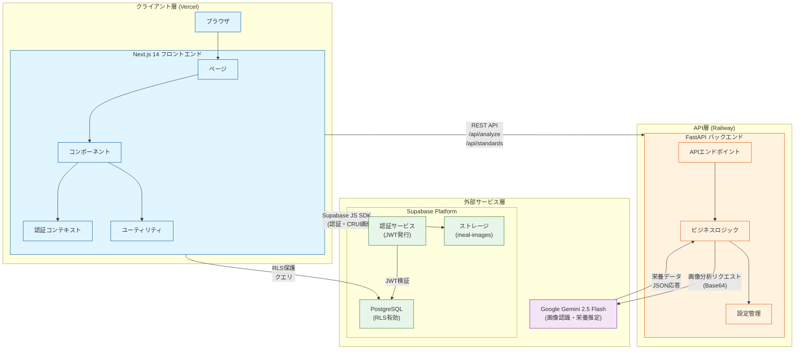
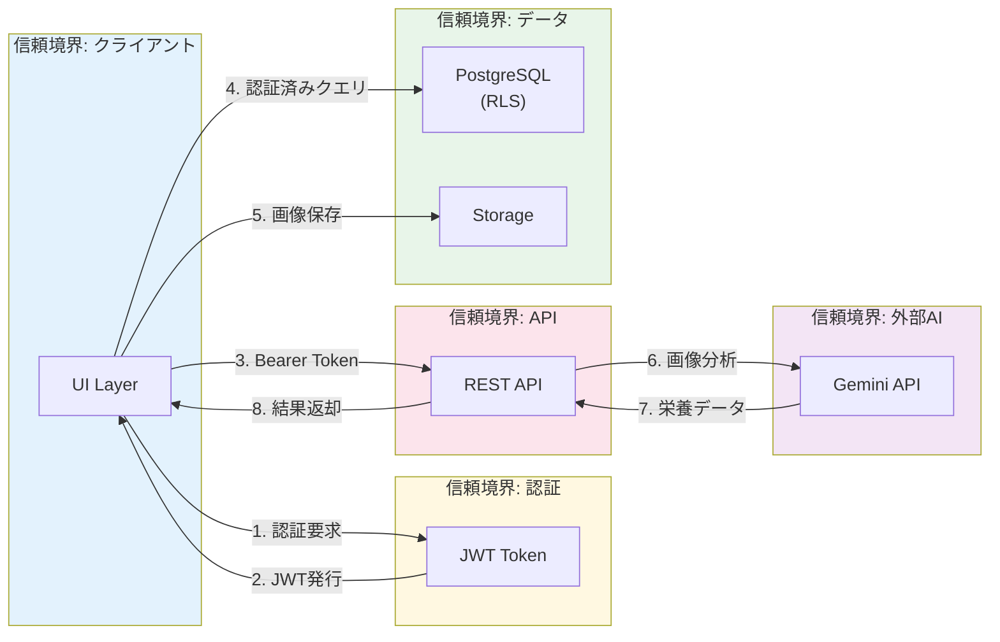

# Architecture Pattern & Boundary Map

糖質管理アドバイザーのアーキテクチャ構成図

## コンポーネント詳細

### クライアント層 (Next.js 14 + React 18)

| コンポーネント | 役割 |
|---------------|------|
| `page.tsx` | メインページ（画像分析UI） |
| `ImageUploader` | ドラッグ&ドロップ画像アップロード |
| `NutritionResult` | 栄養分析結果表示 |
| `NutritionChart` | レーダーチャート（Chart.js） |
| `FoodDetectionOverlay` | 食品位置のバウンディングボックス表示 |
| `SaveMealForm` | 食事記録保存フォーム |
| `AuthContext` | Supabase認証状態管理 |

### API層 (FastAPI + Python 3.11)

| エンドポイント | 機能 |
|---------------|------|
| `POST /api/analyze` | 食事画像分析（Gemini API連携） |
| `GET /api/standards` | 栄養基準値取得 |
| `GET /` | ヘルスチェック |

### 外部サービス層

| サービス | 用途 |
|---------|------|
| Supabase Auth | ユーザー認証・JWT発行 |
| Supabase PostgreSQL | データ永続化（RLS保護） |
| Supabase Storage | 食事画像保存 |
| Google Gemini 2.5 Flash | 画像認識・栄養推定・アドバイス生成 |

## 境界とデータフロー

## セキュリティ境界

| 境界 | 保護機構 |
|------|---------|
| クライアント ↔ API | CORS, HTTPS |
| クライアント ↔ Supabase | JWT認証, RLS |
| API ↔ Gemini | APIキー（環境変数） |
| データベース | Row Level Security |
| ストレージ | バケットポリシー |
