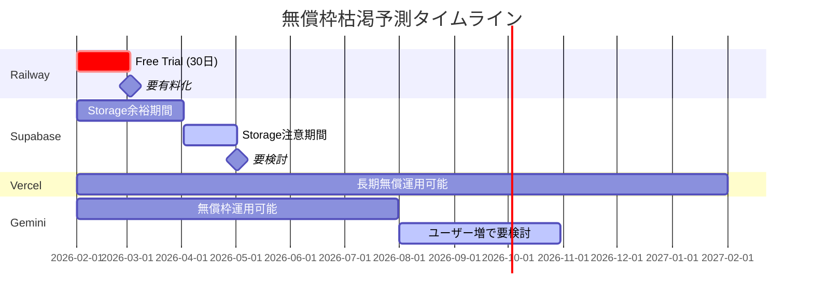

# 費用分析: Railway / Vercel / Supabase 無償枠調査

## 調査日: 2026年1月31日

## 目次
1. [各サービスの無償枠](#1-各サービスの無償枠)
2. [現在の使用状況分析](#2-現在の使用状況分析)
3. [無償枠消費予測](#3-無償枠消費予測)
4. [対策と費用見積もり](#4-対策と費用見積もり)
5. [推奨アクション](#5-推奨アクション)

---

## 1. 各サービスの無償枠

### 1.1 Railway

| 項目 | 無償枠 | 備考 |
|------|--------|------|
| **プランタイプ** | Free Trial（30日間のみ） | ⚠️ **恒久的な無償枠なし** |
| **クレジット** | $5（1回限り） | 使い切ったらサービス停止 |
| **RAM** | 1 GB | Hobbyプランは8GB |
| **vCPU** | 共有コア | 専用コアなし |
| **サービス数** | 5サービス/プロジェクト | - |

**重要な制限事項:**
- Railwayには**恒久的な無償枠が存在しない**
- 30日間のトライアル後、最低$5/月のHobbyプランが必要
- アカウント認証（GitHub連携等）がないとデータベースのみに制限

**有料プラン:**
| プラン | 月額 | 含まれるクレジット |
|--------|------|-------------------|
| Hobby | $5 | $5相当 |
| Pro | $20 | $20相当 |

**参考:** [Railway Pricing](https://railway.com/pricing), [Railway Free Trial Docs](https://docs.railway.com/reference/pricing/free-trial)

---

### 1.2 Vercel

| 項目 | 無償枠 (Hobby) | 備考 |
|------|----------------|------|
| **プランタイプ** | Hobby（無期限無料） | ✅ 個人・非商用限定 |
| **帯域幅** | 100 GB/月 | 約10万PV/月相当 |
| **Edge Requests** | 100万回/月 | - |
| **Serverless実行** | 15万回/月 | - |
| **関数実行時間** | 最大60秒 | Pro: 300秒 |
| **プロジェクト数** | 無制限 | - |
| **環境** | 1環境/プロジェクト | staging/prod分離不可 |
| **チームメンバー** | 1人のみ | 追加不可 |

**重要な制限事項:**
- **商用利用禁止**（収益を生むサービスには使用不可）
- 制限を超過すると**即座に停止**（従量課金なし）
- チーム開発不可

**有料プラン:**
| プラン | 月額 | 主な追加機能 |
|--------|------|-------------|
| Pro | $20/ユーザー | 1TB帯域、100万関数実行、300秒関数 |
| Enterprise | カスタム（約$2万~/年） | SLA、専用サポート |

**参考:** [Vercel Pricing](https://vercel.com/pricing), [Vercel Hobby Plan](https://vercel.com/docs/plans/hobby), [Vercel Limits](https://vercel.com/docs/limits)

---

### 1.3 Supabase

| 項目 | 無償枠 | 備考 |
|------|--------|------|
| **プロジェクト数** | 2プロジェクト | ✅ 無期限無料 |
| **データベース** | 500 MB | PostgreSQL |
| **データベースEgress** | 2 GB/月 | - |
| **認証MAU** | 50,000ユーザー/月 | 十分な量 |
| **ストレージ** | 1 GB | 画像保存用 |
| **ストレージEgress** | 2 GB/月 | - |
| **Edge Functions** | 50万回/月 | - |
| **Realtime** | 200同時接続 | - |

**重要な制限事項:**
- ⚠️ **7日間非アクティブでプロジェクト自動停止**
- 本番環境には不向き（24/7稼働保証なし）
- 商用利用は許可されている

**有料プラン:**
| プラン | 月額 | 主な追加機能 |
|--------|------|-------------|
| Pro | $25 | 8GB DB、100K MAU、100GB Storage、自動停止なし |
| Team | $599 | SOC2、SSO、長期バックアップ |
| Enterprise | カスタム | HIPAA対応、専用サポート |

**実際の運用コスト（Pro）:** 小〜中規模アプリで$35-75/月程度

**参考:** [Supabase Pricing](https://supabase.com/pricing), [Supabase Free Tier Guide](https://www.freetiers.com/directory/supabase)

---

### 1.4 Google Gemini API

| 項目 | 無償枠 | 備考 |
|------|--------|------|
| **プランタイプ** | Free Tier（無期限） | ✅ クレジットカード不要 |
| **Gemini 2.5 Flash** | 10 RPM、250回/日 | 現在使用中のモデル |
| **トークン/分** | 250,000 | 十分な量 |
| **コンテキスト** | 100万トークン | 画像含む |

**2025年12月の変更:**
- 無償枠が50-80%削減された
- 429エラー（クォータ超過）が発生しやすくなった

**有料プラン:**
| モデル | 入力/100万トークン | 出力/100万トークン |
|--------|-------------------|-------------------|
| Gemini 2.5 Flash | $0.50 | $3.00 |
| Gemini 2.5 Pro | $2.00-4.00 | $12.00-18.00 |

**参考:** [Gemini API Pricing](https://ai.google.dev/gemini-api/docs/pricing), [Gemini Rate Limits](https://ai.google.dev/gemini-api/docs/rate-limits)

---

## 2. 現在の使用状況分析

### 2.1 アプリケーションの特性

| 項目 | 内容 |
|------|------|
| **用途** | 食事画像の栄養分析 |
| **ユーザー層** | 個人（糖質制限者） |
| **主要機能** | 画像アップロード → AI分析 → 結果表示/保存 |
| **データ** | 食事画像、栄養データ、ユーザープロフィール |

### 2.2 リソース消費パターン

#### Railway (バックエンド)
```
1回の画像分析リクエスト:
- CPU: 画像処理（EXIF除去、圧縮）+ API呼び出し
- メモリ: 画像データ（最大10MB）+ Gemini応答
- ネットワーク: Gemini API通信（数KB〜数百KB）
- 実行時間: 3-10秒/リクエスト
```

#### Vercel (フロントエンド)
```
1ページビュー:
- 帯域幅: 約200-500KB（JS/CSS/画像）
- Edge Requests: 1-5回
- Serverless: 0回（SSG中心）
```

#### Supabase (データベース/認証/ストレージ)
```
1回の食事保存:
- DB: 約1-2KB（meals + nutrition_data）
- Storage: 約0.5-2MB（画像）
- Auth: 1 MAU（月間アクティブユーザー）
```

### 2.3 推定使用量（月間）

| サービス | 想定使用量（軽使用） | 想定使用量（中使用） | 無償枠 |
|----------|---------------------|---------------------|--------|
| **Railway** | $2-3相当 | $5-8相当 | $5（1回限り） |
| **Vercel帯域** | 1-5 GB | 10-30 GB | 100 GB |
| **Vercel関数** | 1,000-5,000回 | 10,000-30,000回 | 150,000回 |
| **Supabase DB** | 10-50 MB | 100-300 MB | 500 MB |
| **Supabase Storage** | 50-200 MB | 500 MB-1 GB | 1 GB |
| **Gemini API** | 50-100回/日 | 100-250回/日 | 250回/日 |

**使用シナリオ:**
- 軽使用: 1-3人が週数回使用
- 中使用: 5-10人が毎日使用

---

## 3. 無償枠消費予測

### 3.1 Railway（最も早く枯渇）

```
⚠️ 最重要: Railwayは30日トライアルのみ

Timeline:
- Day 0: $5クレジット付与
- Day 7-14: 軽使用で$1-2消費
- Day 14-21: 累計$2-4消費
- Day 21-30: 累計$4-5消費 → クレジット枯渇の可能性

結論: 30日以内にHobbyプラン($5/月)への移行が必要
```

### 3.2 Supabase（次に枯渇の可能性）

```
Database (500 MB):
- 1食事 ≈ 2KB → 250,000食事まで保存可能
- 画像をStorageに保存すればDBは長持ち

Storage (1 GB):
- 1画像 ≈ 1MB → 約1,000枚まで
- 中使用(5人×3食×30日) = 450枚/月
- 約2-3ヶ月で枯渇の可能性

7日間停止ルール:
- 本番運用では致命的
- 定期的なアクセスまたは有料化が必要
```

### 3.3 Vercel（最も余裕あり）

```
帯域幅 (100 GB):
- 現在の使用量では数%程度
- 100,000 PV/月でも余裕

関数実行 (150,000回):
- SSG中心なので消費少
- 長期間無償枠で運用可能
```

### 3.4 Gemini API（制限に注意）

```
250回/日 (Gemini 2.5 Flash):
- 1人3食×10人 = 30回/日 → 余裕
- 50人×3食 = 150回/日 → 余裕
- 100人×3食 = 300回/日 → 超過の可能性

Rate Limit (10 RPM):
- 同時アクセスが多いと429エラー
- ピーク時の考慮が必要
```

### 3.5 枯渇タイムライン



---

## 4. 対策と費用見積もり

### 4.1 無償で使い続ける対策

#### Railway代替案

| 代替サービス | 無償枠 | 制限 |
|-------------|--------|------|
| **Render** | 750時間/月（Webサービス） | スリープあり、遅い起動 |
| **Fly.io** | 3 shared-cpu VMs | リソース制限あり |
| **Vercel Functions** | Vercel Hobbyに含む | FastAPI移行が必要 |
| **Cloudflare Workers** | 10万リクエスト/日 | Python非対応 |

**推奨:** Renderへの移行を検討（スリープ許容なら無料継続可能）

#### Supabase対策

1. **7日停止対策:**
   - cronジョブで定期的にAPIを叩く
   - GitHub Actionsで毎日ヘルスチェック

2. **ストレージ節約:**
   - 画像を圧縮（品質を80%に下げる）
   - 古い画像を定期削除
   - 外部ストレージ（Cloudflare R2等）への移行

3. **DB節約:**
   - 古いデータのアーカイブ
   - JSONBフィールドの最適化

#### Gemini API対策

1. **レート制限対策:**
   - キャッシュ導入（同じ画像の再分析を防ぐ）
   - キューイングで同時リクエストを制御

2. **日次制限対策:**
   - 1ユーザーあたりの分析回数制限
   - ピーク時間の分散

### 4.2 有料化時の費用見積もり

#### 最小構成（個人・小規模）

| サービス | プラン | 月額 |
|----------|--------|------|
| Railway | Hobby | $5 |
| Vercel | Hobby（継続無料） | $0 |
| Supabase | Free（7日対策で継続） | $0 |
| Gemini API | Free Tier | $0 |
| **合計** | | **$5/月** |

#### 推奨構成（本番運用）

| サービス | プラン | 月額 |
|----------|--------|------|
| Railway | Hobby | $5 |
| Vercel | Hobby | $0 |
| Supabase | Pro | $25 |
| Gemini API | Free/Tier 1 | $0-10 |
| **合計** | | **$30-40/月** |

#### 成長構成（中規模）

| サービス | プラン | 月額 |
|----------|--------|------|
| Railway | Pro | $20 |
| Vercel | Pro | $20 |
| Supabase | Pro | $25-50 |
| Gemini API | Tier 1 | $10-30 |
| **合計** | | **$75-120/月** |

### 4.3 年間費用予測

| 構成 | 月額 | 年額 |
|------|------|------|
| 最小構成 | $5 | $60 |
| 推奨構成 | $30-40 | $360-480 |
| 成長構成 | $75-120 | $900-1,440 |

---

## 5. 推奨アクション

### 即座に対応（今月中）

1. **Railway有料化の準備**
   - Hobbyプラン($5/月)への移行を計画
   - または Render への移行を検討

2. **Supabase 7日停止対策**
   - GitHub Actionsで毎日ヘルスチェックを設定
   ```yaml
   # .github/workflows/keepalive.yml
   name: Keep Supabase Alive
   on:
     schedule:
       - cron: '0 0 * * *'  # 毎日UTC 0:00
   jobs:
     ping:
       runs-on: ubuntu-latest
       steps:
         - run: curl -X GET ${{ secrets.SUPABASE_URL }}/rest/v1/
   ```

### 短期（1-3ヶ月）

3. **使用量モニタリング設置**
   - 各サービスのダッシュボードを定期確認
   - アラート設定（可能な場合）

4. **画像最適化**
   - アップロード時の圧縮率調整
   - 古い画像の自動削除ポリシー検討

### 中期（3-6ヶ月）

5. **スケーリング計画**
   - ユーザー数増加時の費用シミュレーション
   - 代替サービスの継続調査

6. **商用化検討時**
   - Vercel ProまたはEnterprise検討（商用利用制限のため）
   - 収益モデルに基づく費用対効果分析

---

## 付録: 費用比較表

### 月間100ユーザー想定

| サービス | 無償枠で対応可能か | 推奨プラン | 月額 |
|----------|-------------------|-----------|------|
| Railway | ❌ 30日で終了 | Hobby | $5 |
| Vercel | ✅ 十分 | Hobby | $0 |
| Supabase | ⚠️ 7日停止リスク | Pro推奨 | $25 |
| Gemini | ✅ 余裕 | Free | $0 |

### 月間1,000ユーザー想定

| サービス | 無償枠で対応可能か | 推奨プラン | 月額 |
|----------|-------------------|-----------|------|
| Railway | ❌ | Pro | $20 |
| Vercel | ⚠️ 商用NGの可能性 | Pro | $20 |
| Supabase | ❌ ストレージ不足 | Pro | $50-75 |
| Gemini | ⚠️ 日次制限接近 | Tier 1 | $20-50 |

---

## 参考リンク

### Railway
- [Railway Pricing](https://railway.com/pricing)
- [Railway Free Trial Docs](https://docs.railway.com/reference/pricing/free-trial)
- [Railway Pricing Plans](https://docs.railway.com/reference/pricing/plans)

### Vercel
- [Vercel Pricing](https://vercel.com/pricing)
- [Vercel Hobby Plan](https://vercel.com/docs/plans/hobby)
- [Vercel Limits](https://vercel.com/docs/limits)

### Supabase
- [Supabase Pricing](https://supabase.com/pricing)
- [Supabase Free Tier Info](https://www.freetiers.com/directory/supabase)

### Google Gemini
- [Gemini API Pricing](https://ai.google.dev/gemini-api/docs/pricing)
- [Gemini Rate Limits](https://ai.google.dev/gemini-api/docs/rate-limits)

---

*最終更新: 2026年1月31日*
