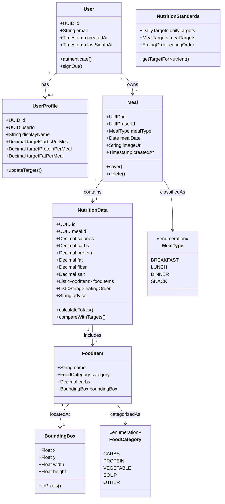
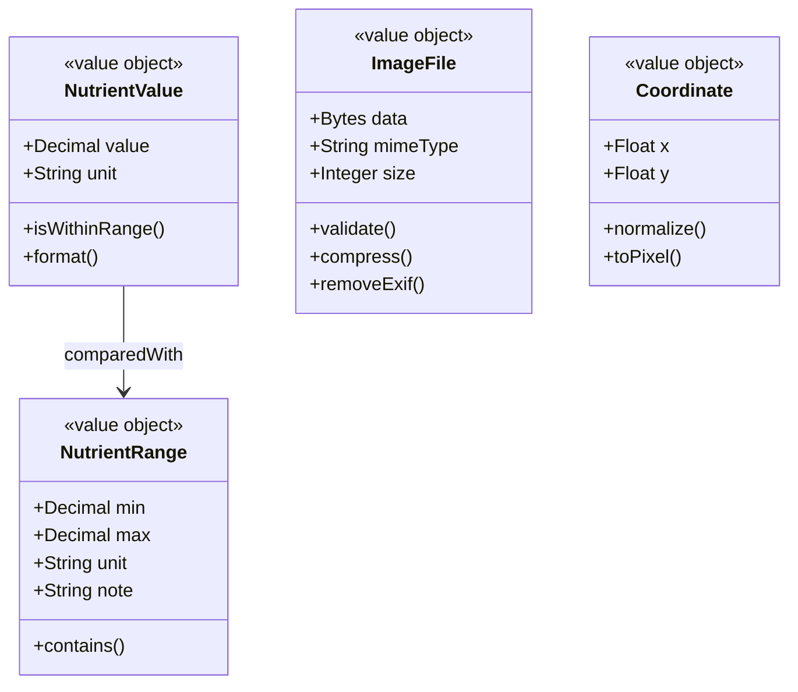
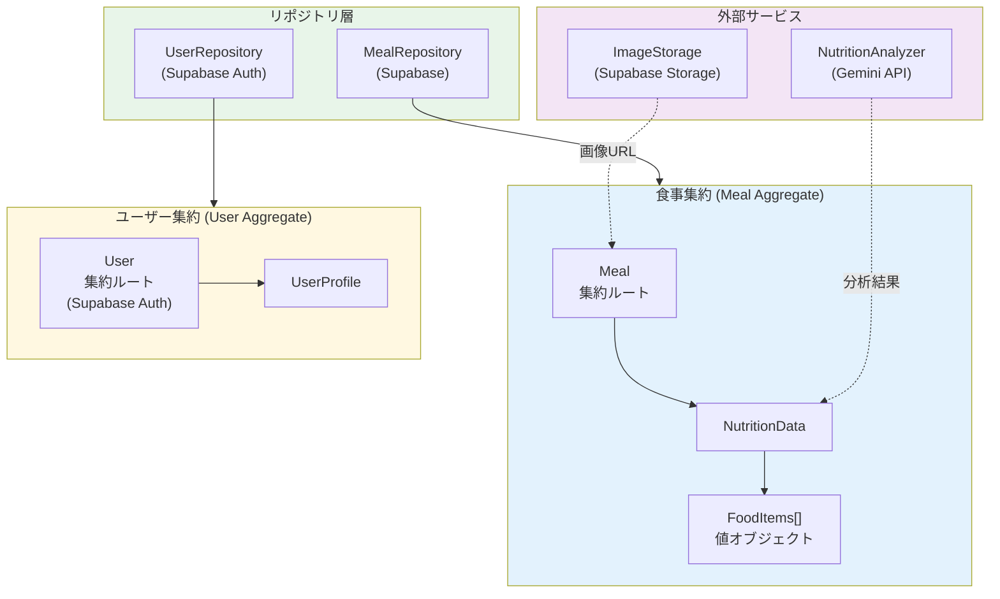
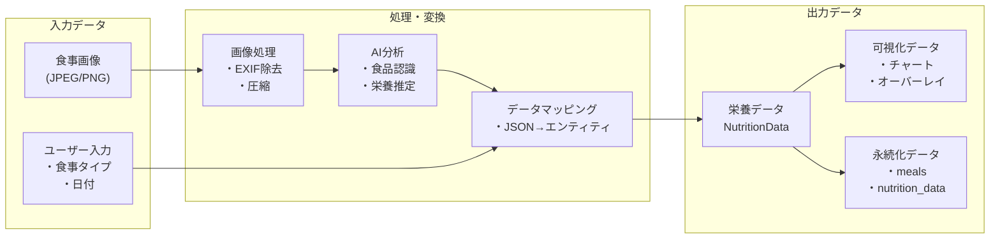
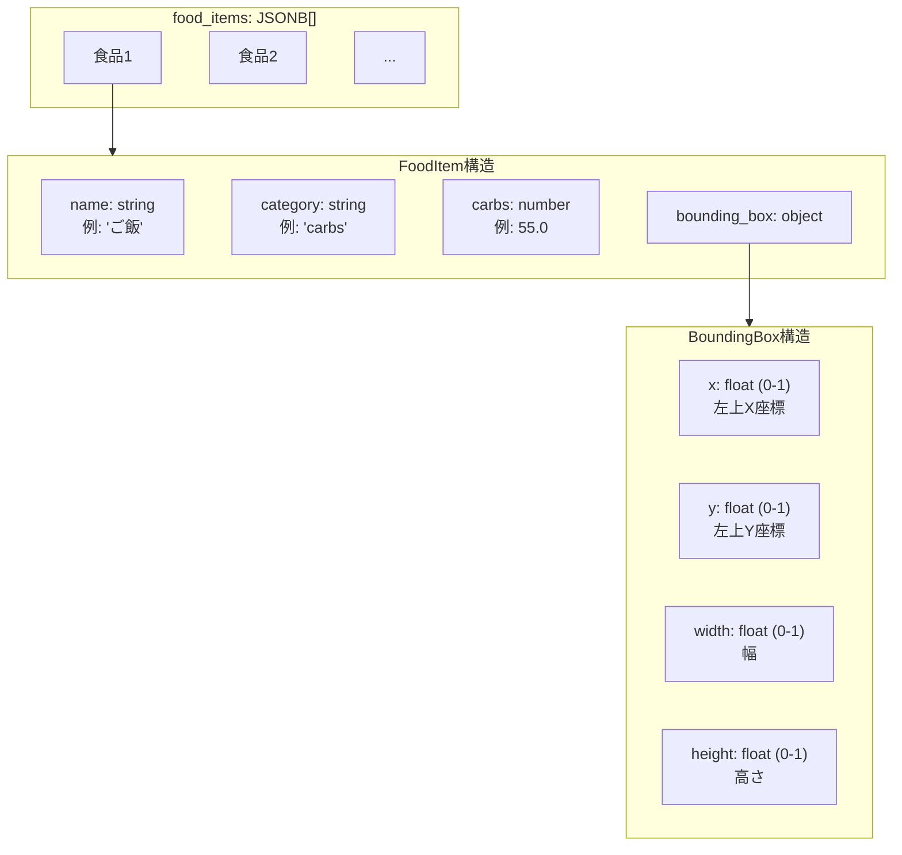
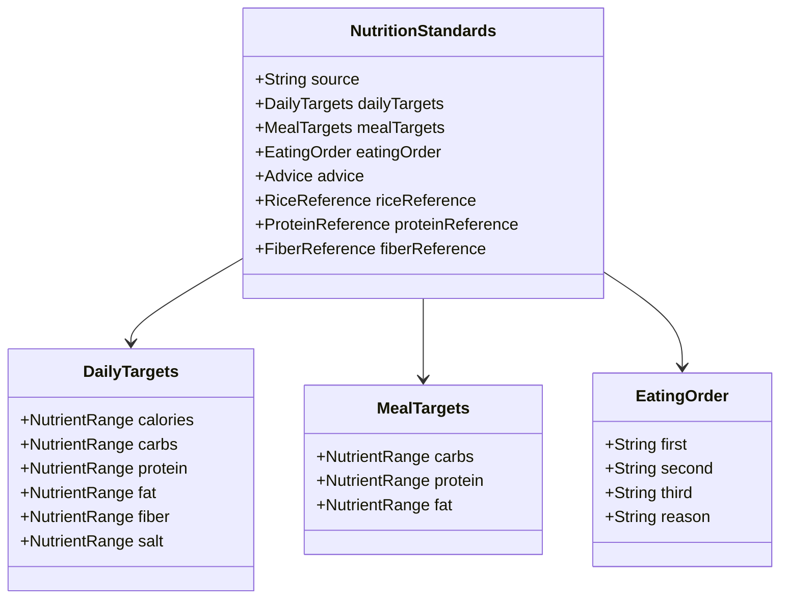
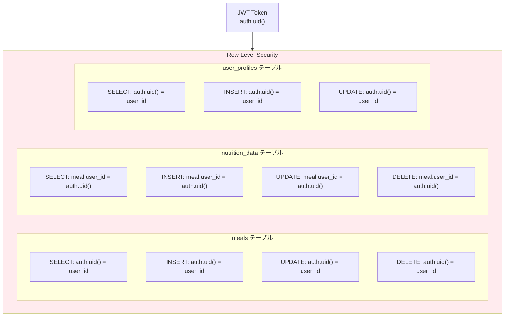

# Domain Model (Data Model)

糖質管理アドバイザーのドメインモデル図

## エンティティ関連図 (ER図)

```mermaid
erDiagram
    USER ||--o{ MEAL : "記録する"
    USER ||--o| USER_PROFILE : "持つ"
    MEAL ||--|| NUTRITION_DATA : "含む"

    USER {
        uuid id PK "Supabase Auth管理"
        string email "メールアドレス"
        timestamp created_at "作成日時"
        timestamp last_sign_in_at "最終ログイン"
    }

    USER_PROFILE {
        uuid id PK
        uuid user_id FK "ユーザーID"
        string display_name "表示名"
        decimal target_carbs_per_meal "目標糖質量/食"
        decimal target_protein_per_meal "目標たんぱく質量/食"
        decimal target_fat_per_meal "目標脂質量/食"
        timestamp created_at "作成日時"
        timestamp updated_at "更新日時"
    }

    MEAL {
        uuid id PK
        uuid user_id FK "ユーザーID"
        varchar meal_type "食事タイプ(breakfast/lunch/dinner/snack)"
        date meal_date "食事日"
        text image_url "画像URL(Storage)"
        timestamp created_at "作成日時"
        timestamp updated_at "更新日時"
    }

    NUTRITION_DATA {
        uuid id PK
        uuid meal_id FK "食事ID"
        decimal calories "カロリー(kcal)"
        decimal carbs "糖質(g)"
        decimal protein "たんぱく質(g)"
        decimal fat "脂質(g)"
        decimal fiber "食物繊維(g)"
        decimal salt "塩分(g)"
        jsonb food_items "認識食品リスト"
        jsonb eating_order "推奨食べ順"
        text advice "AIアドバイス"
        timestamp created_at "作成日時"
    }
```



## ドメインオブジェクト詳細



## 値オブジェクト (Value Objects)



## 集約とリポジトリ



## データフロー



## JSONB フィールド構造

### food_items (認識食品リスト)



### eating_order (推奨食べ順)

```json
[
  "野菜・サラダを最初に",
  "たんぱく質（魚・肉）",
  "炭水化物（ご飯）を最後に"
]
```

## 栄養基準値モデル



## Row Level Security ポリシー



## インデックス構成

| テーブル | インデックス | カラム | 用途 |
|---------|------------|--------|------|
| meals | idx_meals_user_id | user_id | ユーザー別検索 |
| meals | idx_meals_meal_date | meal_date | 日付検索 |
| meals | idx_meals_user_date | user_id, meal_date | 複合検索 |
| nutrition_data | idx_nutrition_data_meal_id | meal_id | 食事との結合 |

## TypeScript 型定義

```typescript
// フロントエンドの型定義 (types/nutrition.ts)

interface NutritionData {
  food_items: string[];
  detected_foods?: DetectedFood[];
  calories: number;
  carbs: number;
  protein: number;
  fat: number;
  fiber: number;
  salt: number;
  advice: string;
  eating_order?: string[];
}

interface DetectedFood {
  name: string;
  category: 'carbs' | 'protein' | 'vegetable' | 'soup' | 'other';
  carbs: number;
  bounding_box?: BoundingBox;
}

interface BoundingBox {
  x: number;      // 0-1 正規化座標
  y: number;
  width: number;
  height: number;
}

interface Meal {
  id: string;
  user_id: string;
  meal_type: 'breakfast' | 'lunch' | 'dinner' | 'snack';
  meal_date: string;
  image_url?: string;
  created_at: string;
  nutrition_data?: NutritionData;
}
```
