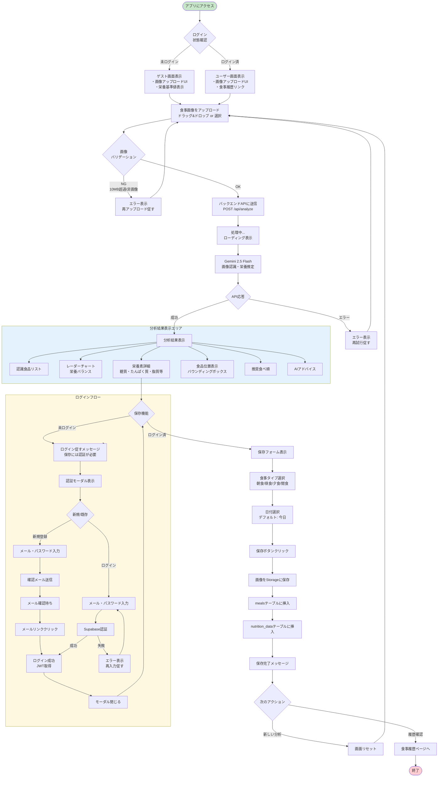
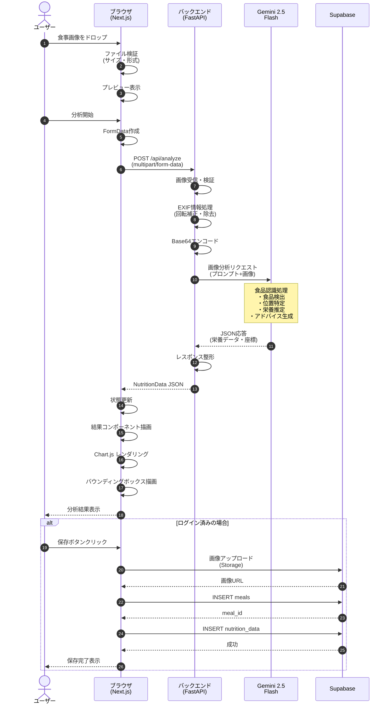
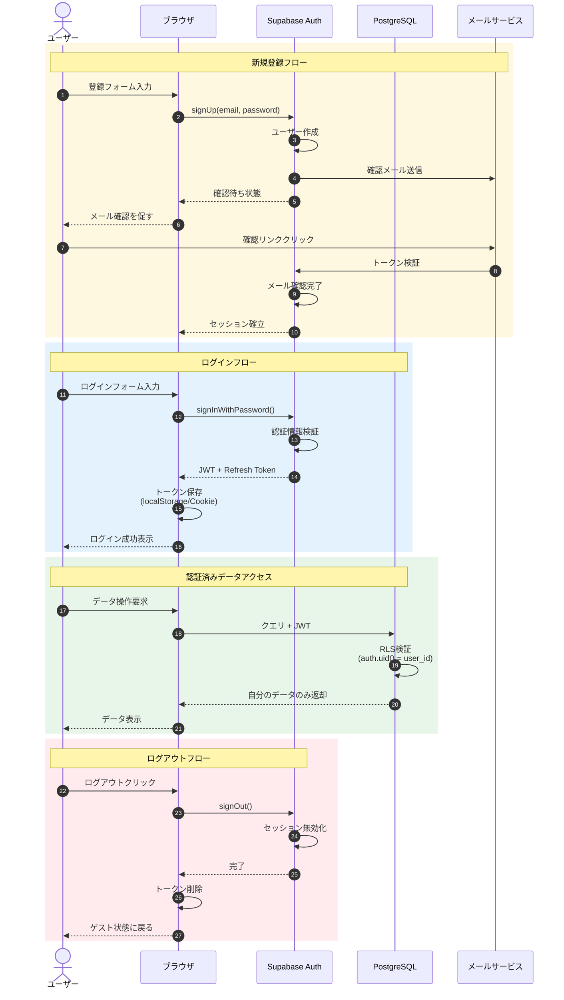
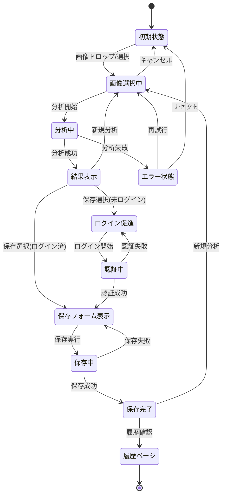

# ユーザー End-to-End 利用フロー

糖質管理アドバイザーのユーザー操作フロー図

## メインフロー: 食事画像分析と保存

## 詳細シーケンス図: 画像分析プロセス

## 認証フロー詳細

## 状態遷移図

## ユーザーシナリオ例

### シナリオ: 糖質制限中のユーザーが昼食を記録

| ステップ | ユーザー行動 | システム応答 |
|---------|------------|-------------|
| 1 | アプリにアクセス | ホーム画面表示 |
| 2 | 「鯖定食」を撮影 | - |
| 3 | 画像をドラッグ&ドロップ | プレビュー表示 |
| 4 | 自動分析開始 | ローディング表示 |
| 5 | 待機（3-5秒） | Gemini API処理 |
| 6 | - | 認識食品: ご飯、鯖、味噌汁、サラダ |
| 7 | - | 糖質62g（超過警告）表示 |
| 8 | - | レーダーチャート表示 |
| 9 | - | 「サラダ→鯖→ご飯」の順推奨 |
| 10 | 「昼食」を選択 | 保存フォーム更新 |
| 11 | 「保存」クリック | 処理中表示 |
| 12 | - | 保存完了メッセージ |
| 13 | 「新しい食事を分析」クリック | 画面リセット |
